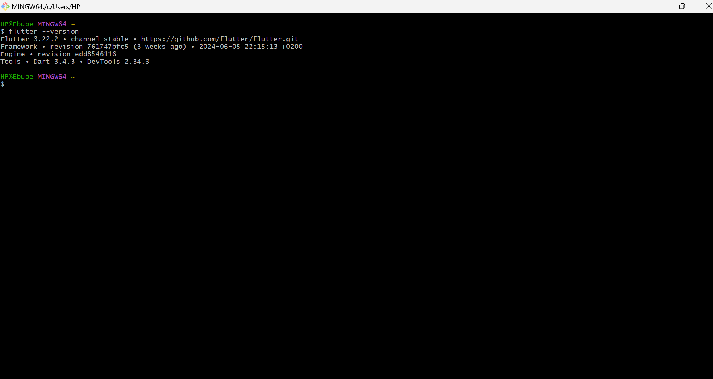

#WINDOWS
1. Already installed on system

#GIT INSTALLATION
1. LINK TO SAMPLE GITHUB PAGE
https://github.com/saybube/plpsamplerep

2. Git bash screenshot below

#VSCODE INSTALLATION
1. vscode downloaded from https://code.visualstudio.com/Download
2. setup done according to instructions

#PYTHON
1. latest version downloaded from htttps://www.python.org
2. followed download instructions and checked the following boxes:
    1. use admin privileges when installing py.exe
    2. add python.exe to PATH

#MYSQL
1. latest version downloaded from https://www.mysql.com/downloads/
2. download myql intsaller community version
3. folllowed download instructions:
4. custom installation:
    1. mysql server
    2. mysql shell
    3. mysql workbench
5. created password

#DART
1. latest version downloaded from www.dart.dev
2. unzip dart
3. create dart directory
4. add dart to PATH

#FLUTTER
1. download flutter
2. create flutter directory
3. add flutter to path

    

